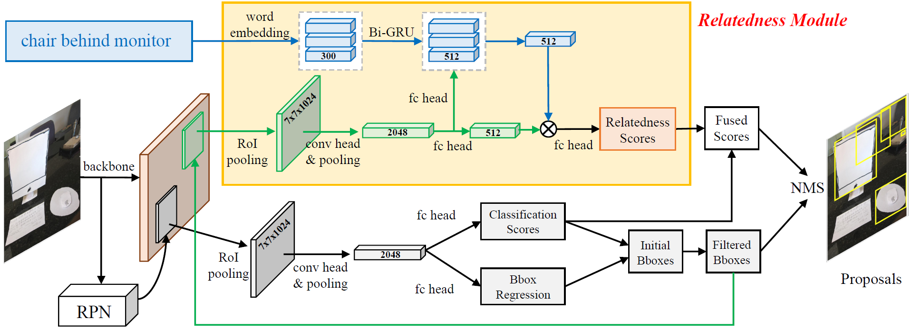

# Ref-NMS
Official codebase for AAAI 2020 paper "Ref-NMS: Breaking Proposal Bottlenecks in Two-Stage Referring Expression Grounding".

## Prerequisites
The following dependencies should be enough. See [environment.yml](environment.yml) for complete environment settings.
- python 3.7.6
- pytorch 1.1.0
- torchvision 0.3.0
- tensorboard 2.1.0
- spacy 2.2.3

## Data Preparation

## Training

## Evaluation

## Pretrained Models

## Citation

## Acknowledgement